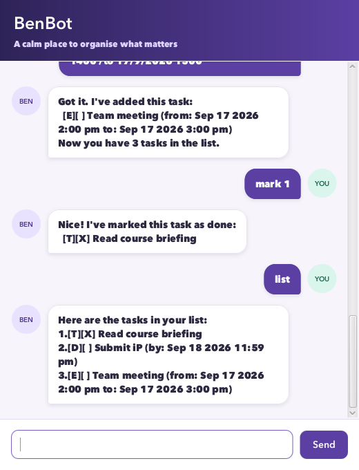

# BenBot User Guide

BenBot is a desktop assistant for keeping tasks, contacts, notes, and expenses
in one place. You interact with it using short text commands, while BenBot
stores your data locally for the next session.



## Contents

- [Quick start](#quick-start)
- [Command format](#command-format)
- [Managing tasks](#managing-tasks)
- [Managing contacts](#managing-contacts)
- [Managing notes](#managing-notes)
- [Managing expenses](#managing-expenses)
- [Saving and exiting](#saving-and-exiting)
- [Frequently asked questions](#frequently-asked-questions)
- [Known limitations](#known-limitations)
- [Command summary](#command-summary)

## Quick start

1. Install Java 25.
2. From the project folder, build BenBot with `./gradlew shadowJar` on macOS or
   Linux, or `gradlew.bat shadowJar` on Windows.
3. Run the generated application:

   ```console
   java -jar build/libs/benbot.jar
   ```

4. Type a command into the box at the bottom of the window.
5. Press <kbd>Enter</kbd> or select **Send**.

For example, this command records a task:

```text
todo Buy groceries
```

BenBot confirms successful commands in the conversation area. If a command is
invalid, it explains what needs to be corrected without changing your data.

## Command format

This guide uses the following notation:

- Words in `UPPER_CASE` are values that you supply. Do not type the placeholder
  name. For example, use `todo Buy groceries`, not `todo DESCRIPTION`.
- Items in square brackets are optional. For example, the time in
  `deadline DESCRIPTION /by DATE [TIME]` may be omitted.
- Command words and parameter markers are lowercase and must appear in the
  order shown.
- Leading, trailing, and repeated spaces are accepted and normalized.
- Dates use `d/M/yyyy`, such as `15/9/2026`.
- Times use the 24-hour `HHmm` format, such as `0900` or `1830`.

Tasks, contacts, notes, and expenses each have their own numbered list. Use the
number shown by the relevant list command when marking or deleting an item.

## Managing tasks

BenBot supports todos, deadlines, and events. It can store up to 100 tasks and
rejects an exact duplicate of an existing task.

### Add a todo

Use a todo for a task without a specific date or time.

Format: `todo DESCRIPTION`

Example:

```text
todo Read chapter 6
```

### Add a deadline

Use a deadline for a task that must be completed by a particular date. The time
is optional.

Format: `deadline DESCRIPTION /by DATE [TIME]`

Examples:

```text
deadline Submit report /by 18/9/2026
deadline Submit slides /by 18/9/2026 2359
```

### Add an event

Use an event for an activity with a start and end. The end must be later than
the start. You may omit either time, but both dates are required.

Format: `event DESCRIPTION /from START_DATE [START_TIME] /to END_DATE [END_TIME]`

Examples:

```text
event Project meeting /from 20/9/2026 1400 /to 20/9/2026 1530
event Reading week /from 21/9/2026 /to 27/9/2026
```

BenBot rejects invalid calendar dates such as `31/2/2026`.

### View all tasks

Format: `list`

The list shows every task, its number, and whether it is complete.

### Find tasks

Search task descriptions for a word or phrase. Matching is case-insensitive and
also finds partial words. The displayed numbers remain the tasks' original
numbers in the full task list.

Format: `find KEYWORD`

Example:

```text
find report
```

### Mark a task as complete

Format: `mark TASK_NUMBER`

Example:

```text
mark 2
```

### Mark a task as incomplete

Format: `unmark TASK_NUMBER`

Example:

```text
unmark 2
```

### Delete a task

Format: `delete TASK_NUMBER`

Example:

```text
delete 3
```

Use `list` first if you are unsure of the task number.

## Managing contacts

A contact contains a name, phone number, and email address. The name may contain
spaces; the phone number and email address must each be a single value without
spaces.

### Add a contact

Format: `contact NAME /phone PHONE /email EMAIL`

Example:

```text
contact Alex Tan /phone 91234567 /email alex@example.com
```

### View all contacts

Format: `contacts`

### Delete a contact

Format: `delete-contact CONTACT_NUMBER`

Example:

```text
delete-contact 1
```

Use `contacts` first to find the contact number.

## Managing notes

Notes are useful for short pieces of information that do not need a completion
status or date.

### Add a note

Format: `note TEXT`

Example:

```text
note Bring an adapter for the presentation
```

### View all notes

Format: `notes`

### Delete a note

Format: `delete-note NOTE_NUMBER`

Example:

```text
delete-note 2
```

Use `notes` first to find the note number.

## Managing expenses

Expenses help you record a description and positive monetary amount. BenBot
accepts whole numbers or decimals with up to two decimal places.

### Add an expense

Format: `expense DESCRIPTION /amount AMOUNT`

Examples:

```text
expense Lunch /amount 5.50
expense Bus fare /amount 2
```

Enter the amount without a currency symbol, sign, thousands separator, or
scientific notation.

### View all expenses

Format: `expenses`

BenBot displays every expense and their total.

### Delete an expense

Format: `delete-expense EXPENSE_NUMBER`

Example:

```text
delete-expense 1
```

Use `expenses` first to find the expense number.

## Saving and exiting

Format: `bye`

BenBot saves all tasks, contacts, notes, and expenses, then closes. Closing the
application window also saves the data. BenBot stores the data in
`data/stored-task`, relative to the folder from which the application was
started.

Data is saved when the application exits, not after every command. If saving
fails, BenBot reports the problem and remains open so that you can correct it
and try `bye` again. It uses a temporary file while saving so that an
interrupted save is less likely to damage the previous data.

When loading, BenBot validates the whole storage file before replacing the
current data. A corrupted file is not partially loaded or overwritten.

## Frequently asked questions

### How do I move my data to another computer?

Exit BenBot first, then copy `data/stored-task` to the same relative location
on the other computer. Start BenBot from the folder containing that `data`
folder.

### What happens if the data file is missing?

BenBot starts with empty lists. The file and its parent folder are created when
you next exit successfully.

### Why did BenBot reject a task number?

Numbers can change after an item is deleted, and each kind of item has a
separate list. Run `list`, `contacts`, `notes`, or `expenses` immediately before
the relevant command and use the number shown there.

### Why was my date rejected?

Check that it uses `d/M/yyyy` and is a real calendar date. Times must use four
digits in 24-hour `HHmm` format. For events, the end must also be strictly later
than the start.

## Known limitations

- BenBot supports at most 100 tasks.
- Commands and parameter markers must be lowercase.
- Contact phone numbers and email addresses cannot contain spaces.
- Data is saved on exit rather than after each successful command.
- The data file is designed for BenBot to manage and should not be edited while
  the application is running.

## Command summary

| Action | Command |
|---|---|
| Add a todo | `todo DESCRIPTION` |
| Add a deadline | `deadline DESCRIPTION /by DATE [TIME]` |
| Add an event | `event DESCRIPTION /from START_DATE [START_TIME] /to END_DATE [END_TIME]` |
| View tasks | `list` |
| Find tasks | `find KEYWORD` |
| Complete a task | `mark TASK_NUMBER` |
| Reopen a task | `unmark TASK_NUMBER` |
| Delete a task | `delete TASK_NUMBER` |
| Add a contact | `contact NAME /phone PHONE /email EMAIL` |
| View contacts | `contacts` |
| Delete a contact | `delete-contact CONTACT_NUMBER` |
| Add a note | `note TEXT` |
| View notes | `notes` |
| Delete a note | `delete-note NOTE_NUMBER` |
| Add an expense | `expense DESCRIPTION /amount AMOUNT` |
| View expenses and total | `expenses` |
| Delete an expense | `delete-expense EXPENSE_NUMBER` |
| Save and exit | `bye` |
